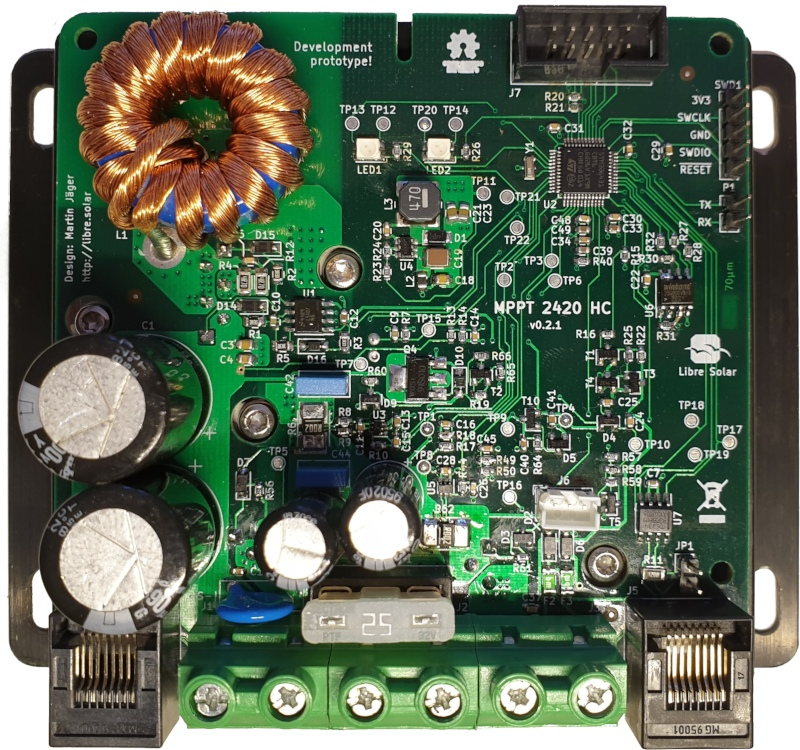

# MPPT charge controller with HS load switch and CAN

 Development ongoing.

Schematic: [PDF file](build/mppt-4820-hc_schematic.pdf)

Bill of Materials: [CSV file](build/mppt-4820-hc_bom_(hv_supply,can).csv) or [interactive HTML BOM](https://libre.solar/mppt-4820-hc/build/mppt-4820-hc_ibom.html)

Firmware repository: [LibreSolar/charge-controller-firmware](https://github.com/LibreSolar/charge-controller-firmware)

This charge controller design is the replacement for the MPPT 2420 LC. We are also working on an integration of MPPT control algorithms for wind turbines.

## Features

- Solar input terminal
    - 15V to 140V operating range
    - 140V maximum open-circuit input
- Battery output terminal
    - 24V / 48V systems
    - Up to 42A @ 24V mode, up to 21A @ 48V mode
    - Up to 1kW output power
- Load terminal: 20A
- New STM32G431 ARM MCU with advanced digital power conversion features
- Expandable via Olimex Universal Extension Connector (UEXT)
- Two bi-color (red/green) LEDs for status indication. Additional user interface can be included in separate PCB in front panel housing and connected via UEXT
- CAN interface via RJ45 connectors

## Current design baseline

- The 24V/48V, 1kW hardware baseline is documented in `docs/HARDWARE_UPGRADE_1KW.md`.
- Source of truth for electrical design is the KiCad schematics in `/home/runner/work/mppt-4820-hc/mppt-4820-hc/kicad`.
- `build/` outputs (PDF/BOM/render) should be regenerated from current schematics before release or manufacturing decisions.

## Mechanical design

- TO-220 MOSFETs can be screwed to large heat sink at the back
- Plastic cover under development
